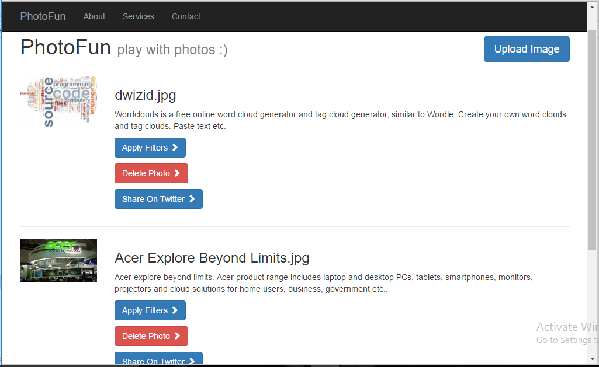
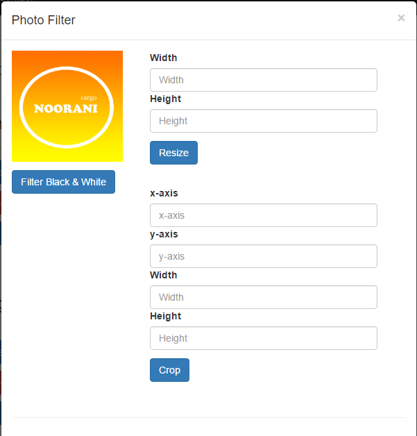

# photofun
play with photos

#### photofun preview
   
   

# `Documentation`

## `Prerequisites`
* install java 1.6 or higher [download](http://www.oracle.com/technetwork/java/javase/downloads/index.html)
* install maven [download](https://maven.apache.org/)
* install apache tomcat [download](http://tomcat.apache.org/)
* install git [download](https://git-scm.com/downloads) - [optional]
* create database `photofun` and a table called `photos` with fields `id [int autoincrement]`, `name [varchar]`, `path [varchar]`, `description [text]`
* create twitter app and generate `consumerKey`, `consumerSecret`, `accessToken`, `accessTokenSecret` keys [tutorial](https://dev.twitter.com/oauth/overview/application-owner-access-tokens)

## `How to download photofun project`
* Run the following command or download zip file [photofun.zip](https://github.com/bit-whacker/photofun/archive/master.zip)
* `git clone https://github.com/bit-whacker/photofun.git`

## `How to build photofun project`
* update your database user/pass in `photofun/src/main/resources/config.properties` file
* enter your twitter's `consumerKey`, `consumerSecret`, `accessToken`, `accessTokenSecret` in the above file
* run the following command from the root directory e.g. `photofun/`
* `mvn package`
* the above command will create `photofun.war` file inside `photofun/target` directory

### `Build photosoap project`
* clone [https://github.com/bit-whacker/photosoap](https://github.com/bit-whacker/photosoap)
* run `mvn package` from inside photosoap's root directory e.g. `photosoap/`
* the above command will create `photosoap-v1.0.war` file inside `photosoap/target` directory

## `How to Run photofun project`
* move to tomcat's `webapps` directory if you installed it in `C://` then it would be in `C:\apache-tomcat-7.0.70\webapps` 
* copy `photofun.war` file from `photofun/target` directory to this `webapps` directory
* copy `photosoap-v1.0.war` file from `photosoap/target` directory to this `webapps` directory
* start tomcat

## `How to access web application e.g photofun service consumer`
* In your web browser visit to [http://localhost:8080/photofun/](http://localhost:8080/photofun/)
* you should see the photofun web aplication from here you can do the following:
* upload image by click on `upload` button on the top right side of the application
* referesh the page to see the uploaded images
* click on delete button behind the image to delete the image
* click on `filter` button to apply different kind of filters on photo

## `About REST Service ROUTES`
* `POST` photofun/rest/photos/upload **upload photo to the server**
* `POST` photofun/rest/photos/share **share photo on twitter** 
* `GET` photofun/rest/photos/fetch?from=0&to=10 **fetchs `N` images from the server options [`from`,`to`]**
* `GET` photofun/rest/photos/find/{id} **finds and returns photo by id**
* `GET` photofun/rest/photos/delete/{id} **deletes and returns photo by id**
